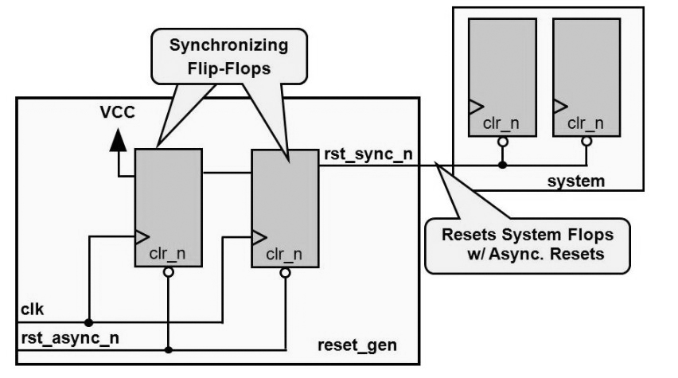

# utility
<!--  -->

# Asynchronous Reset with Synchronous Release



```verilog
reg [1:0] rst_s;
wire rst_sync_n;

always @(posedge clk or negedge rst_async_n) begin
  if (~rst_async_n) rst_s[1:0] <= 2'b00;
  else rst_s[1:0] <= {rst_s[0], 1'b1};
end

assign rst_sync_n = rst_s[1];
```
